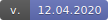

**Vegetation-plot data from Eastern Africa and abroad**

[](http://www.givd.info/ID/AF-00-006)
[](sweadataveg.html)

```{r import_swea, echo=FALSE, results="hide"}
# Object already exists in the session
#load("M:/WorkspaceR/00_Documents/update_databases/sweadataveg.rda")
```

The database **SWEA-Dataveg** is formatted in **PostgreSQL**, including the
extension **PostGIS**. For data exchange (after a respective agreement with the
custodian), objects of class
[**`vegtable`**](https://github.com/kamapu/vegtable) will be preferred.

**SWEA-Dataveg** contains currently records from
**`r format(nrow(sweadataveg_table), big.mark=",")`** plot observations that are
provided by
**`r format(length(unique(sweadataveg_table$data_source)), big.mark=",")`**
sources. Most of those sources are works published either as journal articles or
monographs.

The oldest record was done in
**`r format(min(sweadataveg_table$record_date, na.rm=TRUE), "%d-%m-%Y")`**, while
the newest record is from
**`r format(max(sweadataveg_table$record_date, na.rm=TRUE), "%d-%m-%Y")`**.

```{r map_sweadataveg, echo=FALSE, message=FALSE, out.width="100%"}
library(leaflet)
leaflet(sweadataveg_table) %>% addTiles() %>%
		addCircleMarkers(lng=~longitude, lat=~latitude, color="red",
				opacity=0.3, radius=1)
```
