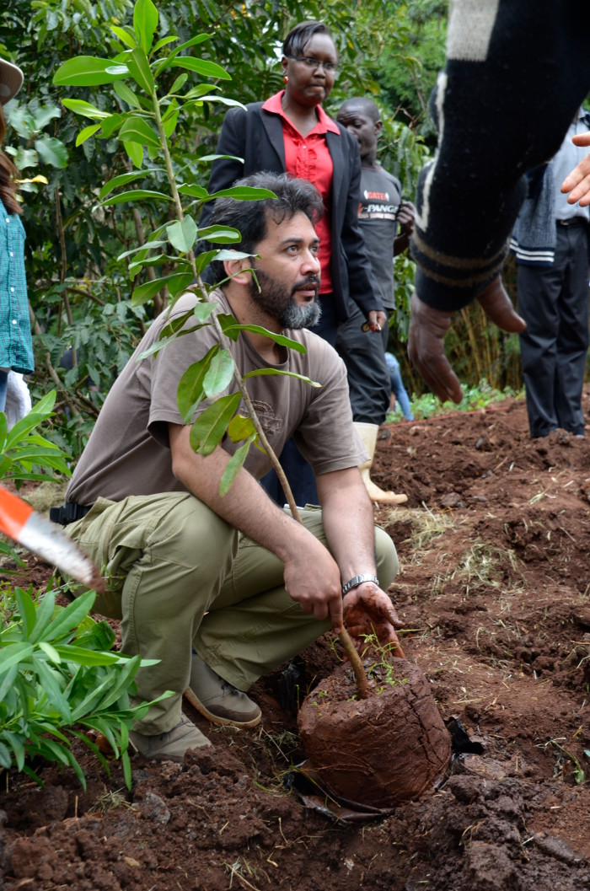
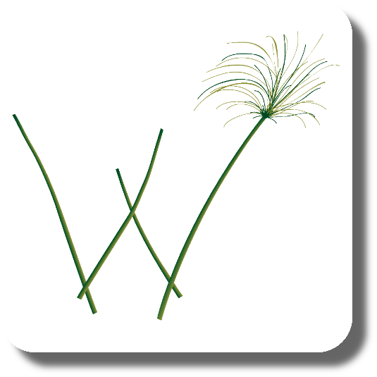
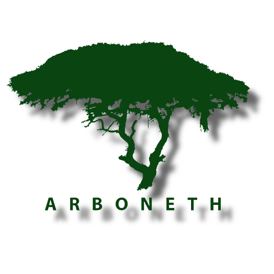
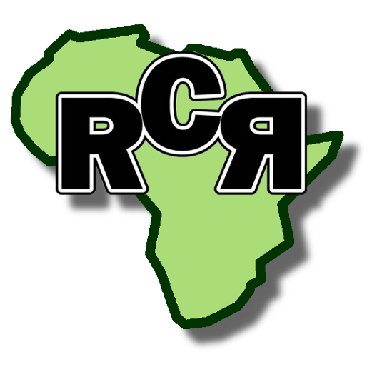
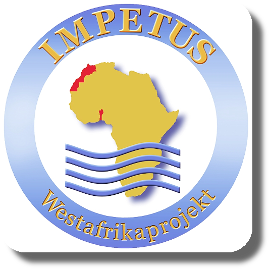

<table>

<tr>
  <td></td>
  <td>
  <b>Miguel Alvarez, Dr. rer. nat.</b>
  
  I am <b>Research Associate</b> at the
  <a href="https://www.ipe.uni-bonn.de/">Plant Nutrition Group</a>,
  University of Bonn, Germany.
  My research activities are focused on plant diversity and vegetation ecology
  in East African wetlands. Additionally, I dedicate some efforts to
  synsystematic classification in diverse formations and in the management of
  data stored in vegetation-plot databases. Some surveys have been also carried
  out in Mediterranean and temperate Chile.
  
  This page is oriented to my services developing tools for handling
  vegetation-plot data and diversity information.
  
  Although most the information presented here is related to my work, it does
  not represent in any way the opinion of the University of Bonn.
  
  <a href="documents/CV_Miguel.pdf">Curriculum Vitae</a>
  
  <a href="documents/Publications_Miguel.pdf">Publication List</a>
  
  </td>
</tr>

</table>

# Research Projects

Research and teaching activities are focused on plant diversity and vegetation
ecology in Eastern Africa (Kenya, Tanzania, Uganda, Rwanda and Ethiopia).

 

## Current Projects

<table>

<tr>
  <td></td>
  <td>
  **Future Rural Africa -- Future-making and social-ecological transformation:**
  
  Evaluating expectations and probabilities in future-making from different
  perspectives, including social and natural sciences.   One of the focus in the
consortium is related to the importance of   **invasive plants** on the ecology
and management of rangelands in Kenya.
  [Read more...](http://www.futureruralafrica.de)
  </td>
</tr>

</table>

 

## Past Projects

<table>

<tr>
  <td></td>
  <td>
  **GlobE-wetlands -- reconciling future food production with environmental
  protection:**
  
  An interdisciplinary project dealing with the effects of cropping activities
  on seasonal wetlands.   While wetlands in sub-Saharan Africa are important sites
for food production,   especially in semi-arid regions, cropping activities may
also have negative   impacts on the integrity of agro-ecosystems.
  [Read more...](https://www.wetlands-africa.de)
  </td>
</tr>

<tr>
  <td></td>
  <td>
  **ARBONETH --  the Ethiopian arboretum network:**
  
  Research and education project supporting ex-situ conservation of native trees
  through the establishment of a network among Ethiopian arboretums.   [Read
more...](https://www.arboneth.com)
  </td>
</tr>

<tr>
  <td></td>
  <td>
  **RCR --  resilience, collapse and reorganization in social-ecological
  systems of African savannas:**
  
  Social systems and environment interact through coupling and regulation
  processes in the bio-physical, political-institutional and symbolic-cultural
  space.   Understanding such processes may allow decision makers to adopt
  strategies   suitables for avoiding collapse of socio-ecological systems
  (SES).   [Read more...](http://resilience-research.de)
  </td>
</tr>

<tr>
  <td></td>
  <td>
  **SWEA -- Agricultural use and vulnerability of small wetlands in East
  Africa:**
  
  Effects of cropping activities on the integrity and productivity of small
  wetlands in Kenya and Tanzania.   [Read
more...](https://www.ipe.uni-bonn.de/verbundprojekte/wetland/swea)
  </td>
</tr>

<tr>
  <td></td>
  <td>
  **IMPETUS -- An integrated approach to the efficient management of scarce
  water resources in West Africa:**
  
  Sustainable management of water resources in Benin and Morocco.   [Read
more...](http://www.impetus.uni-koeln.de/en/project.html)
  </td>
</tr>

</table>
