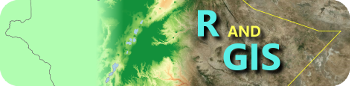

Most of the activities listed here are workshops organized either in the context
of research projects or as voluntary teaching activities.

 

# Analyzing and Documenting Data with Freeware
*2019-08-05 Nairobi, Kenya*

Workshop organized in collaboration between the University of Nairobi in Kenya
and the University of Bonn in Germany and supported by the project [**Future
Rural Africa**](http://www.futureruralafrica.de).
This workshop focused on the applications of **R** on statistical analyses
and **Rmarkdown** for reporting results and making research reproducible.

[**Handout**](documents/free_stats_2019.pdf)

 

# Data for the Future
*2018-09-03 Nairobi, Kenya*

Introduction to the use of relational databases for the storage of quantitative
data with special emphasis to the handling of time as variable.
The workshop activities applied the software **Base** of the
[**LibreOffice**](https://de.libreoffice.org) suite and its connection to
[**R**](https://cran.r-project.org).
This activity was included within the activities of a summer school organised
in the context of the project [**Future Rural
Africa**](http://www.futureruralafrica.de).

[**Handout**](documents/workshops_nairobi_2018.pdf)

 

# Advanced Geospatial Analytics for Resource Assessment and Resilience

*2018-03-20 Kampala, Uganda*

Workshop organized at the [Makerere University](https://www.mak.ac.ug) in
Kampala, Uganda, and founded by the German Academic Exchange Service
([DAAD](https://www.daad.de/en)).

[**Program**](documents/Program_Uganda_2018.pdf)

 

*2017-11-27 Haramaya, Ethiopia*

Workshop about R applications dealing with spatial data (GIS) and organized
within the activities of the project [**ARBONETH**](https://www.arboneth.com).

[**Handout**](documents/RandGIS_2017.pdf)

 

# Introduction to the package vegtable
*2017-03-09 Freiburg im Breisgau, Germany*

This workshop was offered during the
[**16th Meeting on Vegetation Databases**](https://www.hswt.de/person/joerg-ewald/vegetationsdatenbanken.html)
and includes an introduction to the packages `taxlist` and `vegtable`.

[**Handout**](documents/workshops_freiburg_2017.html)

 

# Storage and analysis of vegetation data: a crash course
*2016-11-18 Addis Ababa, Ethiopia*

A very quick introduction on the use of relational models (relational databases)
for the storage of vegetation data.
This activity was organized in the context of the project
[**ARBONETH**](https://www.arboneth.com).

[**Handout**](documents/Handout_ARBONETH_2016.pdf)

 

# Quick introduction to R and the Work with GIS
*2015-11-09 Addis Ababa, Ethiopia*

Workshop about R applications dealing with spatial data (GIS) and organized
within the activities of the project [**ARBONETH**](https://www.arboneth.com).

[**Handout**](documents/RandGIS.pdf)

