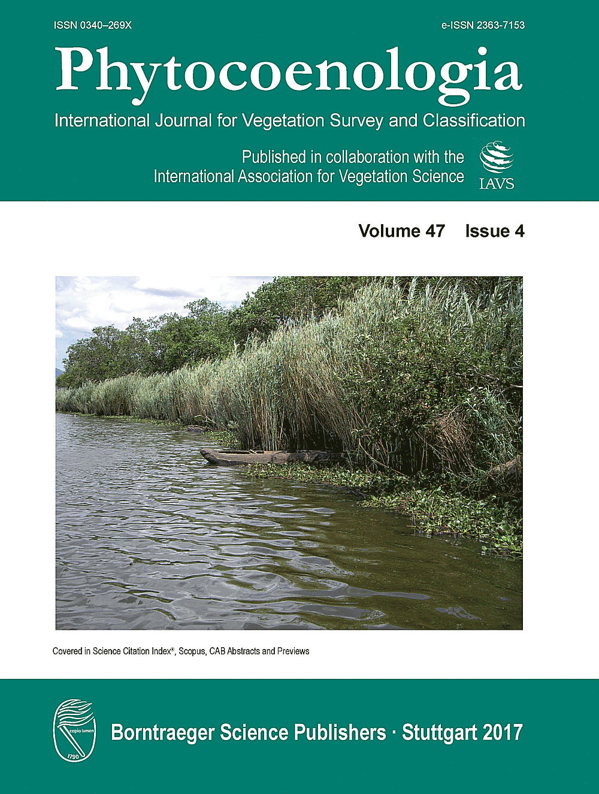

```{r setup, include=FALSE}
knitr::opts_chunk$set(echo = FALSE)
```

After a long process of learning, storing data, collecting publications and
analysing data, the work entitled *Classification of aquatic and semi-aquatic
vegetation in two East African sites: Cocktail definitions and syntaxonomy*
([Alvarez 2017](https://dx.doi.org/10.1127/phyto/2017/0078)) appeared in the
volume 47 of the journal **Phytocoenologia**.
This article assesses vegetation-plots from two localities (one Tanzanian site
and one Kenyan site) with a supervised classification method (Cocktail) and
includes an exhaustive review on previous syntaxonomical works.
One of the localities (Kwasunga in Tanzania) appears in the cover page of the
issue.

Although in this article I am the only author, I was not alone in the journey.
I have to thank **Ulrich Deil** (University of Freiburg, Germany) for allowing
me to access his personal library, **Milan Chytrý** (University of Brno, Czech
Republic) for mentoring me on the hard way of doing Cocktail, and to **Jan
Roleček** (Czech Academy of Sciences, Czech Republic) for his support as
editor.
I also have to thank to two anonymous reviewers of the manuscript and all
Kenyan and Tanzanian colleagues that supported me during the field activities.

<aside>
<a href="https://www.schweizerbart.de/papers/phyto/list/47#issue4" target="_self"> 
     
</a>
</aside>
