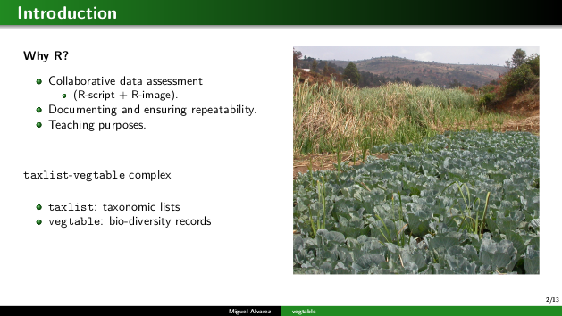

This was a presentation about the basics of the packages
[`vegtable`](https://github.com/kamapu/vegtable) and
[`taxlist`](https://docs.ropensci.org/taxlist/).

These packages can be installed either from **CRAN** (last release) or
**GitHub** (last development version).

```{r eval=FALSE, echo=TRUE}
## Installing from CRAN
install.packages("vegtable", dependencies=TRUE)

## Installing from GitHub
library(remotes)
install_github("ropensci/taxlist", build_vignettes=TRUE)
install_github("kamapu/vegtable")
```

The vignette installed for `taxlist` can be opened by calling it at the
R-console.

```{r eval=FALSE, echo=TRUE}
library(taxlist)

vignette("taxlist-intro")
```

For additional information, visit the respective pages inserted as hypertext at
the beginning of this post.

<aside>
<a href="https://kamapu.github.io/documents/brno_vegtable.pdf" target="_self"> 
     
</a>
</aside>

