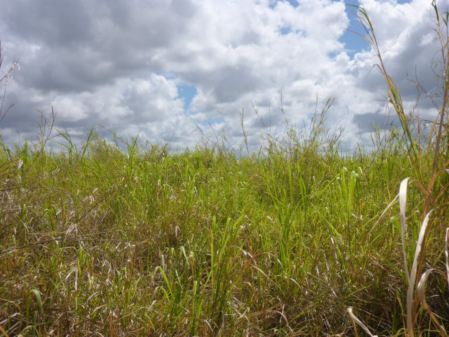

```{r echo=FALSE}
# Scan for citations
library(biblio)
Bib <- read_bib("../../../../db-dumps/literatur_db/bib/MiguelReferences.bib")
Cited <- detect_keys("ea-wetlands.Rmd")
Bib <- subset(Bib, bibtexkey %in% Cited$bibtexkey)
write_bib(Bib, "references.bib")
```

\
Stand of the *Vigno vexillatae-Panicetum fluviicolae* Behn, Alvarez, Mutebi &
Becker 2022 in an undistrubed area within the Kilombero floodplain, Tanzania
(CC-BY-NC K. Behn).

# Introduction

This document contains an example session of the work with plot observations
done in East African wetlands, mixing field surveys and data collected from
published references. This data was assessed in the publication by @Behn2022
and is a modified version of its **Supplement S4** [@Alvarez2021].

This is an attempt to ensure reproducibility on the published statistical
results and promote collaborative data assessment.
Note that we use the term reproducibility in the sense of @Cassey2006
and @Claerbout1992 but it may have a different meaning
[@McArthur2019;@Plesser2018].


# Required Packages

The data set is formated using the package
[`vegtable`](https://kamapu.github.io/vegtable/).
Taxonomic information and species attributes are embedded into `vegtable` but
using [`taxlist`](https://docs.ropensci.org/taxlist/).
Furthermore, bibliographic references are included by using the package
[`biblio`](https://kamapu.github.io/biblio/).

We recommend to install all these packages from their development versions at
GitHub.

```{r eval=FALSE}
library(package = "devtools")
install_github(repo = "ropensci/taxlist", build_vignettes = TRUE)
install_github(repo = "kamapu/vegtable")
install_github(repo = "kamapu/biblio")
```

To reproduce the interactive map at the end of this tutorial, you will need the
package [`leaflet`](http://rstudio.github.io/leaflet/).

```{r eval=FALSE}
install.packages("leaflet")
```

# Data Set

To run this session, you need to download the data by a click on [this
link](https://zenodo.org/record/5111485/files/swea.rda?download=1).
Then copy and paste it into your working directory.

Alternatively you may prefer to download a copy of the R-image using the
following command in your running session.

```{r}
download.file(url = "https://zenodo.org/record/5111485/files/swea.rda?download=1",
    destfile = "swea.rda", method = "curl")
```

This data set was exported from the database **SWEA-Dataveg**, which
is registered in the Global Index of Vegetation-Plot Databases (GIVD) as
[AF-00-006](https://www.givd.info/ID/AF-00-006) [@Alvarez2021a]. To optimize the
content of the object, the data was pre-processed, whereby the most important
changes regarding the original data are:

- Recorded sub-specific taxa (i.e. varieties and sub-species) have been merged
  with their respective species.
- Recorded supra-specific taxa (i.e. genera and families) have been skipped
  from the plot observations.
- Undetermined taxa are excluded.
- Multiple occurrence of a species in a plot have been merged preserving the
  maximum abundance value.
- Cover values have been equalized to the Braun-Blanquet scale for all
  records, where classes **+** and **r** have been merged with class **1**.

To start the work with the distributed data set, you need to load `vegtable` to
your session.

```{r message=FALSE}
library(package = vegtable)
load(file = "swea.rda")
summary(object = swea)
```

## Taxonomic Lists

Plots observations contain records of species' abundance in the respective
plots. In vegetation-plot databases, those records may be collected from
diverse sources and refer to different nomenclatures, thus a link between
synonyms and accepted names to taxon concepts is required. Additionally,
taxonomic ranks, parent-child relationships, and functional traits have to be
considered for further ecological assessments. To deal with this, there is a
slot called **species** including the taxonomic list in a `taxlist` object.

```{r}
summary(object = swea@species)
```

In this taxonomic list you can also query for some species using its name
(partial matchings are also allowed).

```{r}
summary(object = swea@species, ConceptID = "Cyclosorus interruptus",
		secundum = "bibtexkey")
```

This summary shows the ID of the taxon (taxon concept ID), the taxon
view (reference used for the nomeclature), its taxonomic rank (level), the
parent taxon (the parent genus in this case), the accepted name and a list
of synonyms (both including usage name ID).

You can also use the function `indented_list()` to have an overview of the
hierarchical structure including this taxon.

```{r}
indented_list(object = swea@species, filter = "Cyclosorus")
```

For more details on the structure of `taxlist` objects, see @Alvarez2018.

## Header and Relations

Information related to plot observations (e.g. soil properties, slope,
exposition, coordinates) is stored as a `data.frame` in the slot **header**. In
this column-oriented table the variable **ReleveID** represents the primary
key.

```{r}
head(x = swea@header)
```

Categorical variables in **header** may need detailed descriptions on their
respective classes, if they are factorized. For this purpose, a slot called
**relations** contains the respective data frames. Both the data frame in the
slot **relations** and the variable shared with slot **header** have the same
name.

```{r}
names(x = swea@relations)
```

For instance the field **country_code** has a relation of the same name with an
homonymous primary key. This field works then as a foreign key in slot
**header**.

```{r}
head(x = swea@relations$country_code)
```

## Samples

The core of plot observations is the record of taxa (usually plant species)
indicating either their occurrence or their abundance in the respective plots.
Since `vegtable` objects emulate relational databases, this information is
contained in column-oriented table, at the slot **samples**.

```{r}
head(x = swea@samples)
```

In this table, the variable **ReleveID** is pointing to the plot observations in
slot **header**, while the variable **TaxonUsageID** is linked to the slot
**species**. The later is rather a mention of the taxon usage name recorded in
the plot, which will be recognized either as synonym or accepted name of a taxon
concept.
The abundance of the species in plots (variable **cover_class**) corresponds to
the Braun-Blanquet scale with the classes "+" and "r" merged with "1", as
previously mentioned.


# Cocktail Classification

Cocktail classification is a supervised classification method based on logical
algorithms. The main elements in these algorithms are the definition of species
groups (cocktail groups) and dominant species. The algorithms will recognize
plot observations in a vegetation unit by the occurrence of more than a half of
the members of a coctail group, the absence of a group and whether a dominant
species is present over a cut-level of abundance or not
[@Bruelheide1997;@Koci2003].

The package `vegtable` defines an object class called `shaker`. This object will
always depend on a `vegtable` object (companion). A `shaker` is included in
the distributed image, which is called `syntax`.

```{r results="hide"}
summary(object = syntax, companion = swea)
```

The design of cocktail algorithms is a time-consuming, iterative process and
will not be explained here. We recommend to use the software
[**Juice**](https://www.sci.muni.cz/botany/juice/) for this purpose
[@Tichy2002]. The function `make_cocktail()` will execute the expert system and
produce the classification that can be inserted in the data set.

```{r}
swea@header <- make_cocktail(shaker = syntax, vegtable = swea, cover = "cover_class",
		syntax = "veg_unit")
```

For every formula contained in `syntax`, a binary variable indicating whether a
plot is belonging to a vegetation unit or not.
Additionally a column defined as **veg_unit** is inserted with the name of the
respective units. Note that in this column observations that are not
recognized in any vegetation unit get a **NA** value, while observation
recognized in more than one unit get a **+** symbol.

```{r}
summary(object = as.factor(x = swea$veg_unit))
```

# Statistics from Taxon Traits

## Life Forms and Origin

The taxonomic list includes information on life forms and origin (native or
introduced to sub-Saharan Africa).
This information can be summarized for every plot, for instance calculating the
proportion of life forms, weighted by the abundance.
For it, we can use the function `trait_proportion()`, which will aggregate
proportions of single life form classes into plot observations.
Since we like to collect the information in the slot **header** with further
plot properties, we will use the option `in_header=TRUE`.

```{r}
swea <- trait_proportion(trait = "life_form", object = swea, weight = "cover_class",
		in_header = TRUE)

# Boxplot
par(las = 1, mar = c(4, 8, 1, 1))
boxplot(formula = obligate_annual_prop ~ veg_unit, data = swea@header, horizontal = TRUE,
		col = "grey", ylab = "", xlab = "Proportion of Annual Plants")
abline(v = 0.5, lty = "dashed")
```

Note that `trait_proprotion()` is designed to calculate proportions of
categorical traits. Alternatively the function `trait_stats()` is suitable for
statistics of numerical traits (e.g. calculation of weighted averages).

## Taxonomy

Taxonomic information is not mandatory in taxonomic lists. In slot **species**
of the object `swea` both, the taxonomic ranks and the parent-child
relationships are included.

```{r}
summary(object = swea@species)
```

For statistical assessments it is necessary to set taxonomic information as
species traits. This can be managed with the function `tax2traits()`.

```{r}
swea@species <- tax2traits(object = swea@species, get_names = TRUE)
head(x = swea@species@taxonTraits)
```

The last function inserted new columns for taxonomic ranks indicating the
usage name of each taxon (without author name) and its respective parent taxa.
In the next step we will calculate the frequency of species in each family.

```{r}
# Counting species per family
Families <- count_taxa(object = species ~ family, data = swea@species)

# Sorting families by frequency
Families <- Families[order(Families$species_count, decreasing = TRUE), ]

# Ploting the 20 most frequent families
par(las = 2, mar = c(10, 5, 1, 1))
with(data = Families[1:20,], expr = barplot(species_count, names.arg = family,
				ylab = "Number of Species"))
```

To see if there is some trend in the proportion of a family, for instance
Poaceae, we can use again the function `trait_proportion()`. Herewith we will
weight the proportion of families by the abundance of the
respective species in the plot.

```{r}
swea <- trait_proportion(trait = "family", object = swea, weight = "cover_class",
		in_header = TRUE)

# Boxplot
par(las = 1, mar = c(4, 8, 1, 1))
boxplot(formula = Poaceae_prop ~ veg_unit, data = swea@header, horizontal = TRUE,
		col = "grey", ylab = "", xlab = "Proportion of Grasses")
abline(v = 0.5, lty = "dashed")
```

# Export Functions

The structure of `vegtable` objects is quite complex and some assessments or
displays will require a proper export method. Here we introduce some of the
basic ways to export information for further assessments.
For instance, some of those functions will work on a subset of plots, which
include the species `r print_name(swea@species, 206)`

```{r}
cype_pap <- subset(x = swea, subset = TaxonName == "Cyperus papyrus", slot = "taxonNames")
```

In the previous step only records for
`r print_name(swea@species, 206, second_mention = TRUE)` are preserved, thus we
will use the plot observation ids to produce a subset with full relevés.

```{r}
cype_pap <- subset(x = swea, subset = ReleveID %in% cype_pap$ReleveID, slot = "header")
```

## Cross-table

The most common format for displaying vegetation data is the cross table,
with species as rows and plots as columns. To produce cross tables there is the
function `crosstable()`. This function requires a formula in the form
*abundance twidles species and plot* (in the example,
`cover_class ~ ReleveID + AcceptedName`) and a function to summarize multiple
occurrences of a species in a plot (e.g. the maximum value). Depending on the
size of the data set, this process may require some seconds.

```{r}
Table <- crosstable(formula = cover_class ~ ReleveID + AcceptedName, data = cype_pap,
		FUN = max)
```

Note that the terms **ReleveID** and **AcceptedName** are the key variables for
the slot **header** and the object `taxlist` in slot **species**, respectively.

It is also possible to insert additional columns besides the species list, for
instance to add the author name (**AuthorName**  in `taxlist`) and the family,
you need to add them as terms in the formula.

```{r}
Table <- crosstable(formula = cover_class ~ ReleveID + AcceptedName + AuthorName + family,
		data = cype_pap, FUN = max, na_to_zero = TRUE)

# First 5 rows and 10 columns
Table[1:5, 1:10]
```

Some statistical software and R-packages may need the first cross table but
transposed. This can be achieved by changing the formula in the function.

```{r}
Table <- crosstable(formula = cover_class ~ AcceptedName + ReleveID, data = swea,
		FUN = max, as_matrix = TRUE)
```

## Juice table

There is also a possibility to export the content of plot observations to
[**Juice**](https://www.sci.muni.cz/botany/juice/). Juice is a freeware
specialized in the analysis of vegetation-plot data sets and implement a series
of statistical assessment methods. To produce the data sets, there is the
function `write_juice()`, which is working in a similar way as `crosstable()`.
Here we need additionally to specify which header variables will be exported and
which are the geographical coordinates (assumed as decimal degrees in WGS84).

```{r eval=FALSE}
write_juice(data = swea, file = "swea", formula = cover_class ~ ReleveID + AcceptedName, 
		db_name = swea@description$name,
		header = c("country_code", "data_source", "record_date", "plot_size", "elevation",
				"veg_unit"),
		coords = c("longitude", "latitude"), FUN = max)
```

This command will produce two files in your working directory, the file
**swea_table.txt** with the cross table, and **swea_header.txt** with the
information of plots (also called header table). To import those files to
Juice, yo need to follow these steps.

## Map

The plot observations included in this data set are geo-referenced, where the
exactitude of the location is depending on the data source (some data are
geo-referenced according to the study site description of the respective
publication).

The location of plot observations can be mapped by using the package `leaflet`.

```{r}
library(package = leaflet)
leaflet(data = swea@header, width = "100%") %>%
    addProviderTiles("Esri.WorldImagery") %>%
	addMarkers(lng = ~longitude, lat = ~latitude, popup = ~paste(ReleveID),
      clusterOptions = markerClusterOptions()) %>%
    addMiniMap(width = 100, height = 100)
```

## Updated on {.appendix}

`r format(Sys.Date(), "%d-%m-%Y")`
