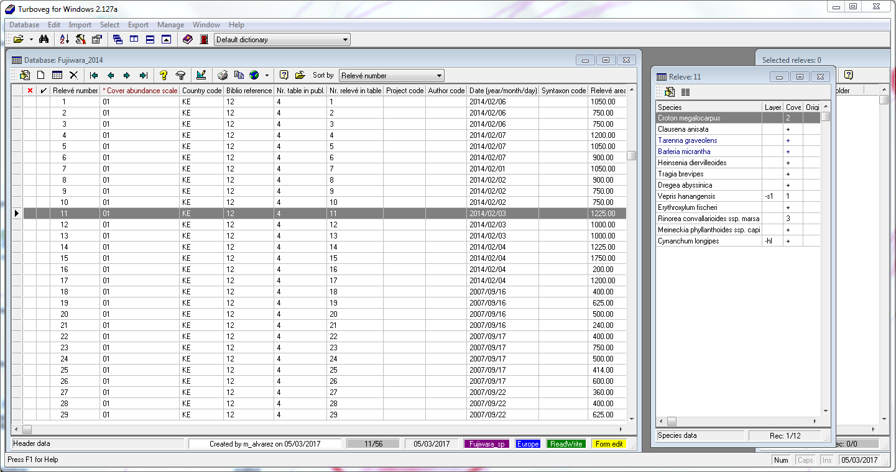
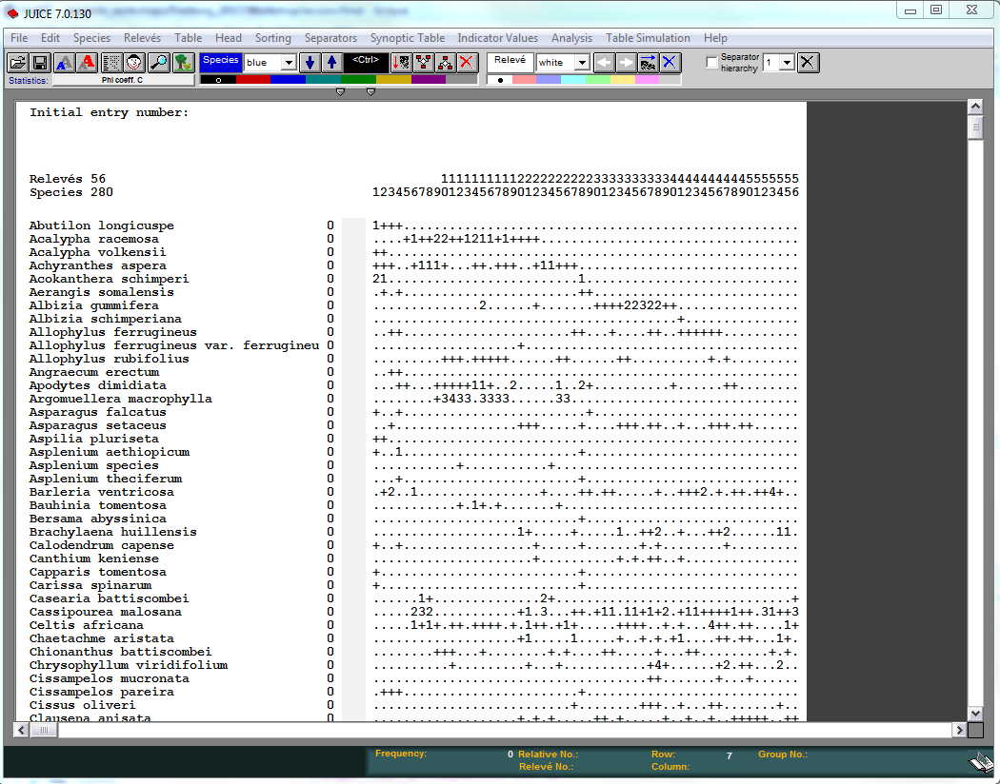
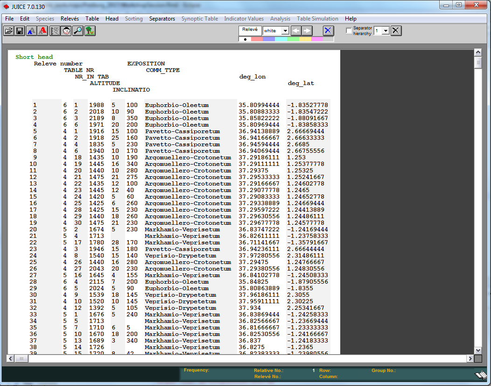

```{r setup, include=FALSE}
## Set global chunk options
knitr::opts_chunk$set(echo=TRUE, width="\\textwidth", out.width="\\textwidth",
		R.options=list(width=80))
```

The program of the workshop is accessible
[here](https://www.hswt.de/fileadmin/user_upload/Book_of_Abstracts_16th_Workshop_Vegetation_Databases_and_Natura_2000_Freiburg_9-10_March_2017.pdf).

# First Steps

This session deals with the management and process of taxonomic lists and
retrieving information from vegetation-plot databases. Following software will
be required for this session:

- [R](https://www.r-project.org/)
- [RStudio](https://www.rstudio.com/)
- [Turboveg](https://www.synbiosys.alterra.nl/turboveg/)
- [Juice](http://www.sci.muni.cz/botany/juice/)
- [Google Earth](https://www.google.com/earth/)


## Installation of requirements in R

Though all required R-packages will be installed in the computer room previous
to this session, here there are instructions, in the case you try to
repeat the sessions in your own computer. Following command line should be
executed in order to install all required packages in `R`:

```{r install_requirements, eval=FALSE}
install.packages(c("devtools", "foreign", "plotKML", "rgdal", "sp", "vegdata",
	"vegan", "xlsx"), dependencies=TRUE)
```

This session will focus on the use of two packages that use
[**GitHub**](https://github.com/) as repository for sharing and development. The
package [`taxlist`](https://github.com/ropensci/taxlist) processes taxonomic
lists that may be connected to biodiversity information (e.g. vegetation
relevés), while the package
[`vegtable`](https://github.com/kamapu/vegtable) has a
similar task but handling vegetation-plot records. Since `vegtable` is
depending on `taxlist`, both packages should be installed and updated for this
session: 

```{r install_github, eval=FALSE}
library(remotes)
install_github("ropensci/taxlist", build_vignettes=TRUE)
install_github("kamapu/vegtable", build_vignettes=TRUE)
```

Since both package are been uploaded in the Comprehensive R Archive Network
(CRAN), you can also use the common way to get the last released version.

```{r install_cran, eval=FALSE}
install.packages("vegtable", dependencies=TRUE)
```

## Documents and data sets

This is the main document of the Workshop and will be distributed among its
participants. Additionally, data sets required for the examples are provided by
the installation of the R-packages `taxlist` and `vegtable`.


# Introduction to taxlist

The package `taxlist` define an homonymous `S4` class. Among other properties,
`S4` classes implement a formal definition of objects, tests for their
validation and functions (methods) applied to them. Such properties are suitable
for structure information of taxonomic lists and for data handling.

```{r taxlist_class, results="hide", message=FALSE}
library(taxlist)
showClass("taxlist")
```

This class is composed by four slots, corresponding to column-oriented tables
(class `data.frame` in **R**). While the slots `taxonNames` and
`taxonRelations`
contain the information on names (labels of taxon concepts) and taxon concepts,
respectively, representing the core information of taxonomic lists.

 most important information regarding taxa (taxon concepts), information in
slots `taxonTraits` and `taxonViews` is optional and they can be empty.


## Building taxlist objects

Building `taxlist` objects can be achieved either through a step-by-step routine
working with small building blocks or by importing consolidated data sets.


### Using character vectors

Objects of class `taxlist` can be just built from a list of names formatted as
a character vector. To achieve it, the functions `new` and `add_concept` are
required.

```{r vector2taxlist, results="hide"}
plants <- c("Lactuca sativa","Solanum tuberosum","Triticum sativum")
splist <- new("taxlist")
splist <- add_concept(splist, plants)
summary(splist)
```


### Using formatted tables

In the case of consolidated species lists, they can be inserted in a table
previously formatted for `taxlist` (or **Turboveg**). Such tables can include
both, accepted names for plant species as well as their respective synonyms. A
formatted table is installed in the package `taxlist`.

```{r df2taxlist1, results="hide"}
File <- file.path(path.package("taxlist"), "cyperus", "names.csv")
Cyperus <- read.csv(File, stringsAsFactors=FALSE)
str(Cyperus)
```

This table was originally imported form **Turboveg** and inherits some of its
default columns. Four columns were renamed and are mandatory for process the
table with the function `df2taxlist`:

- `TaxonUsageID` is the key field of a table of names (slot `taxonNames`).
- `TaxonConceptID` is the link of the name to its respective concept (key
field in slot `taxonRelations`.
- `TaxonName` is the name itself as character.
- `AuthorName` is a character value indicating the author(s) of the respective
name.

Additionally the functions require a logical vector indicating, which of those
names should be considered as synonyms or accepted names for its respective
concept. This information is provided by the inverse value of the column
`SYNONYM` in **Turboveg**.

```{r df2taxlist2}
Cyperus <- df2taxlist(Cyperus, !Cyperus$SYNONYM)
summary(Cyperus)
```


### Using Turboveg species list

A direct import from a **Turboveg** database can be done using the function
`tv2taxlist`. The installation of `vegtable` includes data published by
**Fujiwara et al. (2014)** with vegetation plots collected in forest stands from
Kenya.

```{r tv2taxlist, results="hide", message=FALSE}
library(vegtable)
tv_home <- file.path(path.package("vegtable"), "tv_data")
Fujiwara <- tv2taxlist("Fujiwara_sp", tv_home)
summary(Fujiwara)
```


## Summary displays

For `taxlist` objects there are basically two ways for displaying summaries.
The first way is just ot apply the function `summary` to a `taxlist` object:

```{r overall_summary}
summary(Cyperus)
```

Note that this option also executes a validity check of the object, as done by
the function `validObject`.

The second way is getting information on a particular concept by adding it
concept ID or a taxon usage name as second argument in the function.

```{r single_concept}
summary(Cyperus, "Cyperus dives")
```

Specific information for several concepts can be displayed by using a vector
with several concept IDs. Through the option `ConceptID="all"` it is also
possible to get a display of the first concepts, depending on the value of the
argument `maxsum`.

```{r many_species, results="hide"}
summary(Cyperus, "all", maxsum=10)
```


## Example data set

The installation of `taxlist` includes the data `Easplist`, which is formatted
as a `taxlist` object. This data is a subset of the species list used by the
database **SWEA-Dataveg** ([GIVD ID
AF-006](http://www.givd.info/ID/AF-00-006 "SWEA-Dataveg")):


```{r load_easplist, results="hide"}
data(Easplist)
summary(Easplist)
```


## Access to slots

The common ways to access to the content of slots in `S4` objects are either
using the function `slot(object, name)` or the symbol `@` (i.e. `object@name`).
Additional functions, which are specific for `taxlist` objects are
`taxon_names`, `taxon_relations`, `taxon_traits` and `taxon_views` (see the help
documentation).

Additionally, it is possible to use the methods `$` and `[` , the first for
access to information in the slot `taxonTraits`, while the second can be also
used for other slots in the object.

```{r}
summary(as.factor(Easplist$life_form))
```


## Subsets

Methods for the function `subset` are implemented in order to generate subsets
of the content of `taxlist` objects. Such subsets usually apply pattern matching
(for character vectors) or logical operations and are analogous to query
building in relational databases. The `subset` method can be apply to any slot
by setting the value of the argument `slot`. 


```{r papyrus_otp1, results="hide"}
Papyrus <- subset(Easplist, grepl("papyrus", TaxonName), slot="names")
summary(Papyrus, "all")
```

Or the very same results:

```{r papyrus_opt2, results="hide"}
Papyrus <- subset(Easplist, TaxonConceptID == 206, slot="relations")
summary(Papyrus, "all")
```

Similarly, you can look for a specific name.

```{r phragmites, results="hide"}
Phraaus <- subset(Easplist, charmatch("Phragmites australis", TaxonName),
	slot="names")
summary(Phraaus, "all")
```


## Parent-child relationships

Objects belonging to the class `taxlist` can optionally content parent-child
relationships and taxonomic levels. Such information is also included in the
data `Easplist`, as shown in the summary output.

```{r summary_again}
summary(Easplist)
```

Note that such information can get lost once applied `subset`, since the
respective parents or children from the original data set are not anymore in the
subset. May you like to recover parents and children, you can use the functions
`get_paretns` or `get_children`, respectively.

```{r recover_parents}
summary(Papyrus, "all")
Papyrus <- get_parents(Easplist, Papyrus)
summary(Papyrus, "all")
```


# Introduction to vegtable

Objects of class `vegtable` are complex objects attempting to handle the most
important information contained in vegetation-plot databases. They are defined
in the homonymous package, while the species list will be required as a
`taxlist` object.

As already mentioned, `S4` objects are composed by slots:

```{r show_vegtable, results="hide"}
library(vegtable)
showClass("vegtable")
```

The information contained in the slot is the following:

* `description` is containing the "metadata" of the database as a named
character vector.
* `samples` is a column oriented table with the observations of species (as
usage IDs) in plots and layers.
* `header` is a table containing information on the plots.
* `species` is the taxonmic list as `taxlist` object.
* `relations` are tables linked to categorical variables in slot `header`
(called `popups` in **Turboveg**).
* `coverconvert` is a list with conversion tables among cover scales.

## Building vegtable objects

An empty object (prototype) can be generated by using the function `new`:

```{r new2vegtable}
Veg <- new("vegtable")
```

It is also possible to build an object from cross tables, assuming all species
included in the table are accepted names:

```{r df2vegtable, results="hide"}
File <- file.path(path.package("vegtable"), "Fujiwara_2014", "samples.csv")
Fujiwara <- read.csv(File, check.names=FALSE, stringsAsFactors=FALSE)
Fujiwara_veg <-df2vegtable(Fujiwara, 1, 2)
summary(Fujiwara_veg)
```


## Example data set

The package `vegtable` also provides own data sets as examples. One of those
examples is `dune_veg`, which contains the data sets `dune` and `dune.env` from
the package `vegan`.

```{r load_dune, results="hide"}
data(dune_veg)
summary(dune_veg)
```

Other example is `Kenya_veg`, which also represent a subset of the database
**SWEA-Dataveg** ([GIVD ID
AF-00-006](http://www.givd.info/ID/AF-00-006 "SWEA-Dataveg")).


```{r load_Kenya}
data(Kenya_veg)
summary(Kenya_veg)
```

As shown in the previous commands, the function `summary` displays a general
overview of the object's content, while it also runs a validity check. An
additional display is offered by the function `vegtable_stat`:

```{r vegtable_stat}
vegtable_stat(Kenya_veg)
```


## Access to slots

Some functions are provided for the access to slots of `vegtable` objects,
namely `header` and `veg_relation`, `taxon_traits` and `taxon_views` (see the
help documentation).

For a direct access of the content included in slot `header`, there are the
methods `$` and `[`:

```{r access_header, results="hide"}
summary(Kenya_veg$REFERENCE)
veg_relation(Kenya_veg, "REFERENCE")[,1:3]
```


## Subsets

As a way to generate queries from `vegtable` objects, a method for the function
`subset` is implemented as well. Following is the case of the data set
`dune_veg` generating a subset with pasture plots.

```{r dune_veg}
data(dune_veg)
pasture <- subset(dune_veg, Use == "Pasture")
summary(dune_veg)
summary(pasture)
```


## Cross tables

Most of the applications dealing with analysis of vegetation tables (e.g. the
package `vegan`) will deal with cross tables rather than with column-oriented
database lists. Therefore a function `crosstable` is defined for the conversion
of `taxlist` objects to cross tables. Before building a cross table it will be
recommended to transform the cover into percentage value by using the function
`transform`.

```{r crosstable1, results="hide"}
pasture <- cover_trans(pasture, to="Cover", rule="middle")

Cross <- crosstable(Cover ~ ReleveID + AcceptedName, pasture, max,
	na_to_zero=TRUE)
Cross
```

The first argument in the function is the formula `y ~ x1 + x2 + ... + xn`,
where:

* `y` is the cover value (a column in slot `samples`).
* `x1` is the plot ID or a grouping value from slot `header` which will be used
  as columns in the cross table.
* `x2` is the output for species (either `TaxonName` or `AcceptedName`).
* `x3` to `xn` are additional information for the rows, such as layer, etc.

The second argument is the `vegtable` object and the third is a function, which
will be applied in the case of multiple values in a cell (e.g. multiple records
of a species within a plot).

Note that there is also a method dealing with class `data.frame` (see the help
documentation).

```{r crosstable2, results="hide"}
dune_veg <- cover_trans(dune_veg, to="Cover", rule="middle")

Cross_use <- crosstable(Cover ~ Use + AcceptedName, dune_veg, sum,
	na_to_zero=TRUE)
Cross_use
```

While the previous commands show statistics of groups in a vegetation table, it
is also possible to write a presence-absence table:

```{r presence_absence, results="hide"}
Cross_pa <- crosstable(Cover ~ ReleveID + AcceptedName, pasture, function(x) 1,
	na_to_zero=TRUE)
Cross_pa
```


# Import from Turboveg

The original task of `vegtable` was the import of **Turboveg** databases in R.
Thus one of the oldest functions in the package is `tv2vegtable`.

```{r tv2list, message=FALSE, warning=FALSE}
tv_home <- file.path(path.package("vegtable"), "tv_data")
Fujiwara <- tv2vegtable("Fujiwara_2014", tv_home)
summary(Fujiwara)
```



In the case there is an error message produced by inconsistent data structure,
there is the possibility of importing the data as a list for further inspection.

```{r tv2vegtable, eval=FALSE}
Fujiwara_list <- tv2vegtable("Fujiwara_2014", tv_home, output="list")
```


# Export to Juice

Export of data for **Juice** follows a similar procedure as for cross tables.

```{r, eval=FALSE}
write_juice(Fujiwara, "RiftValley",
	COVER_CODE ~ ReleveID + AcceptedName + LAYER,
	header=c("TABLE_NR","NR_IN_TAB","ALTITUDE","INCLINATIO","EXPOSITION",
		"COMM_TYPE"),
	FUN=paste0)
```

Besides the `vegtable` object, the most important elements to export are:

* `formula` indicating how to construct the cross table.
* `header` to show which variables should be exported for the head data.
* `coords` with the names of coordinates, if present.
* `FUN` the function used for aggregate multiple records.

The values for `coords` should be as decimal degrees and in the spatial system
**WGS 84**. In Juice such information will be included in the header data as
columns **deg_lon** and **deg_lat**, allowing the display of plots in **Google
Earth**. The previous command has generated two files, namely
**RiftValley_table.txt** and **RiftValley_header.txt**.

For importing the table, you may follow the steps:

* Open **Juice**
* In menu `File -> Import -> Table -> From Spreadsheet File (e.g. EXCEL Table)`
* Browse to **RiftValley_table.txt** and `Open`
* In the last step, select the option `Braun-Blanquet Codes` and `Finish`
* Finally, save the new file



Now for the head:

* In menu `File -> Import -> Header Data -> From Comma Delimited File`
* Browse to **RiftValley_header.txt** and `Open`




# Map in leaflet

For geo-referenced plots, you can easily map the location of the plots, for
instance using the package [`leaflet`](https://rstudio.github.io/leaflet/).

```{r, message=FALSE}
library(leaflet)
leaflet(Fujiwara@header) %>%
    addTiles() %>%
    addCircleMarkers(lng=~LONGITUDE, lat=~LATITUDE, color="red",
        opacity=0.3, radius=1)
```

Then, hopefully you enjoyed the session and did not get too much error messages.

## Updated on {.appendix}

`r format(Sys.Date(), "%d-%m-%Y")`

## Aknowledgements {.appendix}

This workshop was supported by the project
[GlobE-wetlands](https://www.wetlands-africa.de).
