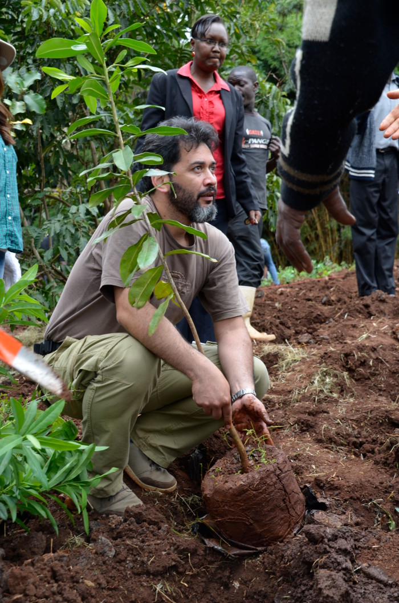

<table>

<tr>
  <td></td>
  <td>
  <b>Miguel Alvarez, Dr. rer. nat.</b>
  
  I am <b>Research Associate</b> at the
  <a href="https://www.ipe.uni-bonn.de/">Plant Nutrition Group</a>,
  University of Bonn, Germany.
  My research activities are focused on plant diversity and vegetation ecology
  in East African wetlands. Additionally, I dedicate some efforts to
  synsystematic classification in diverse formations and in the management of
  data stored in vegetation-plot databases. Some surveys have been also carried
  out in Mediterranean and temperate Chile.
  
  This page is oriented to my services developing tools for handling
  vegetation-plot data and diversity information.
  
  Although most the information presented here is related to my work, it does
  not represent in any way the opinion of the University of Bonn.
  
  <a href="documents/CV_Miguel.pdf">Curriculum Vitae</a>
  
  <a href="documents/Publications_Miguel.pdf">Publication List</a>
  
  </td>
</tr>

</table>

 