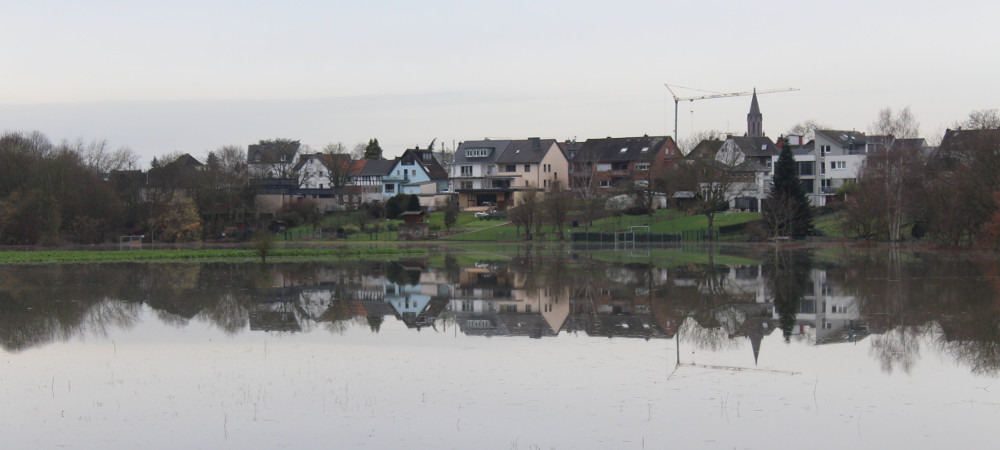
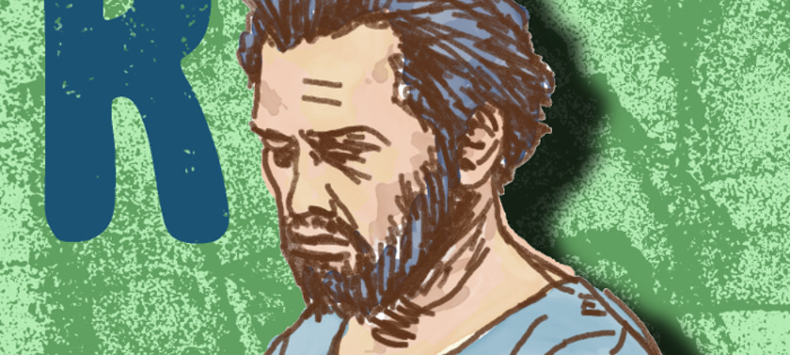

  
  <h3><a href="https://photos.app.goo.gl/JfGTO3U2RQIJwPDE2">Flooding in Troisdorf-Bergheim</a></h3>
  

  Pictures captured during a flooding on <i>06-01-2018</i> in the Sieg River, at its mouth into the Rhine River.
  The flooding was caused by heavy rains at the beginning of the year.
  

 

  
  <h3><a href="https://photos.app.goo.gl/xIaXfAIOnbemHgck2">Art Gallery</a></h3>
  

  A small collection of art works, many of those produced during lazyness.
  My favourite techniques are drawing and linoleum cut.
  

