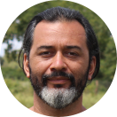

**Miguel Alvarez, Dr. rer. nat.**

<aside>

</aside>

I am a enthusiastic vegetation ecologist, botanist, teacher and programmer.

My work has been related with impact of human activities on natural ecosystems,
classification of vegetation and maintenance of biodiversity databases,
including vegetation-plot databases.

As a strong supporter of open source applications and freeware, I had focused
my programming abilities on **R** and related tools such as **Rmarkdown**.

Physically you can meet me either in Europe, Eastern Africa or South America
and here is the place to find more details about me.

[**My CV**](documents/CV_Miguel.pdf)

[**My Publication List**](documents/Publications_Miguel.pdf)
