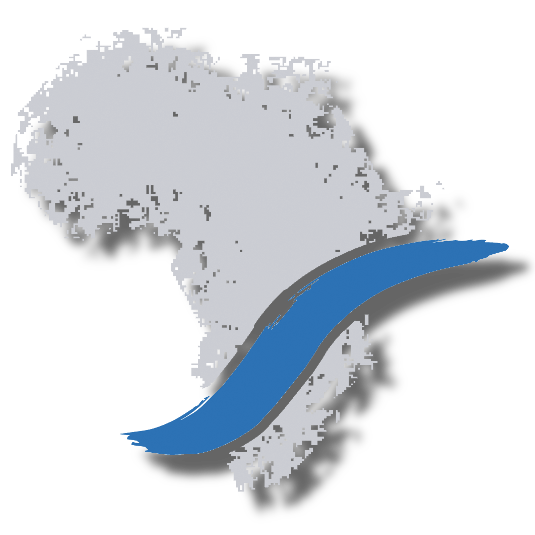

This page introduces you to my activities as docent, researcher and developer.
Maybe also some of my abilities as artist.

# Research Projects

Research and teaching activities are focused on plant diversity and vegetation
ecology in Eastern Africa (Kenya, Tanzania, Uganda, Rwanda and Ethiopia).

## Current Projects

<table>

<tr>
  <td></td>
  <td>
  **Future Rural Africa -- Future-making and social-ecological transformation:**
  
  Evaluating expectations and probabilities in future-making from different
  perspectives, including social and natural sciences.
  One of the focus in the consortium is related to the importance of
  **invasive plants** on the ecology and management of rangelands in Kenya.
  [Link](http://www.futureruralafrica.de)
  </td>
</tr>

<tr>
  <td></td>
  <td>
  <b>GlobE-wetlands -- reconciling future food production with environmental
  protection: </b>
  
  An interdisciplinary project dealing with the effects of cropping activities
  on seasonal wetlands.
  While wetlands in sub-Saharan Africa are important sites for food production,
  especially in semi-arid regions, cropping activities may also have negative
  impacts on the integrity of agro-ecosystems.
  <a href="https://www.wetlands-africa.de">Link</a>
  </td>
</tr>

<tr>
  <td></td>
  <td>
  <b>ARBONETH --  the Ethiopian arboretum network:</b>
  
  Research and education project supporting ex-situ conservation of native trees
  through the establishment of a network among Ethiopian arboretums.
  <a href="https://www.arboneth.com">Link</a>
  </td>
</tr>

</table>

 

## Past Projects

<table>

<tr>
  <td></td>
  <td>
  <b>RCR --  resilience, collapse and reorganization in social-ecological
  systems of African savannas:</b>
  
  Social systems and environment interact through coupling and regulation
  processes in the bio-physical, political-institutional and symbolic-cultural
  space.   Understanding such processes may allow decision makers to adopt
strategies   suitables for avoiding collapse of socio-ecological systems (SES).
  <a href="http://resilience-research.de">Link</a>
  </td>
</tr>

</table>
