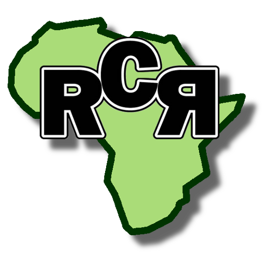

This page introduces you to my activities as docent, researcher and developer.
Maybe also some of my abilities as artist.

Following is a listing of current and past projects:

<table>

<tr>
  <td></td>
  <td>
  <b>GlobE-wetlands:</b>
  
  Wetlands, with year-round water availability, high resource base quality and
  the potential to harvest several times per year present production hot-spots in
  an otherwise degraded landscape.
  <a href="https://www.wetlands-africa.de">Link</a>
  </td>
</tr>

<tr>
  <td></td>
  <td>
  <b>RCR:</b>
  
  Wetlands, with year-round water availability, high resource base quality and
  the potential to harvest several times per year present production hot-spots in
  an otherwise degraded landscape.
  <a href="https://www.wetlands-africa.de">Link</a>
  </td>
</tr>

<tr>
  <td></td>
  <td>
  <b>ARBONETH:</b>
  
  Wetlands, with year-round water availability, high resource base quality and
  the potential to harvest several times per year present production hot-spots in
  an otherwise degraded landscape.
  <a href="https://www.wetlands-africa.de">Link</a>
  </td>
</tr>

</table>

 

