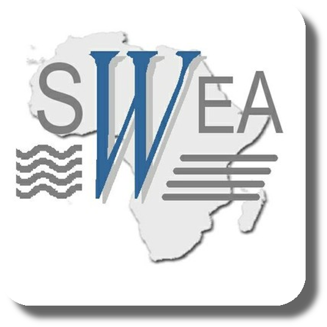

# Research Projects

### Future Rural Africa

**Future Rural Africa -- Future-making and social-ecological transformation**

Evaluating expectations and probabilities in future-making from different
  perspectives, including social and natural sciences.   One of the focus in the
consortium is related to the importance of   **invasive plants** on the ecology
and management of rangelands in Kenya.

<aside>

</aside>

### GlobE-wetlands

**GlobE-wetlands -- Reconciling future food production with environmental
protection**

An interdisciplinary project dealing with the effects of cropping activities on
seasonal wetlands.
While wetlands in sub-Saharan Africa are important sites for food production,
especially in semi-arid regions, cropping activities may also have negative
impacts on the integrity of agro-ecosystems.

<aside>

</aside>

### ARBONETH

**ARBONETH -- The Ethiopian arboretum network**

Research and education project supporting ex-situ conservation of native trees
through the establishment of a network among Ethiopian arboretums.

<aside>

</aside>

### RCR

**RCR -- Resilience, collapse and reorganization in social-ecological systems of
African savannas**

Social systems and environment interact through coupling and regulation
processes in the bio-physical, political-institutional and symbolic-cultural
space.
Understanding such processes may allow decision makers to adopt strategies
suitables for avoiding collapse of socio-ecological systems (SES).

<aside>

</aside>

### SWEA

**SWEA -- Agricultural use and vulnerability of small wetlands in East Africa**

Effects of cropping activities on the integrity and productivity of small
wetlands in Kenya and Tanzania.

<aside>

</aside>

### IMPETUS

**IMPETUS -- An integrated approach to the efficient management of scarce water
resources in West Africa**

Sustainable management of water resources in Benin and Morocco.

<aside>

</aside>

