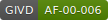

[](http://www.givd.info/ID/AF-00-006)

```{r import_swea, echo=FALSE, results="hide"}
load("data/swea_dataveg_plots.rda")
```

Short description of database.

This database is currently including
**`r format(nrow(swea_dataveg_plots), big.mark=",")`** plot observations.

```{r map_swea, echo=FALSE, message=FALSE, out.width="100%"}
library(leaflet)
leaflet(swea_dataveg_plots) %>% addTiles() %>%
		addCircleMarkers(lng=~longitude, lat=~latitude, color="red",
				opacity=0.3, radius=7)
```

